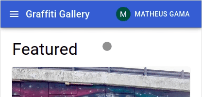
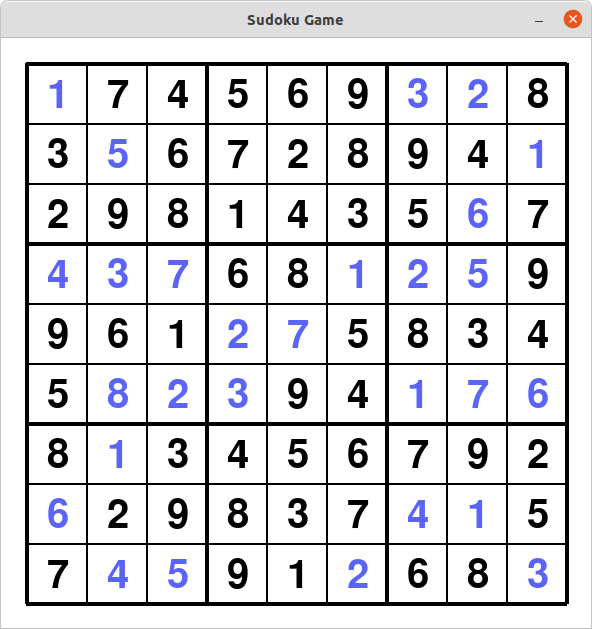

# 100 Days Of Code - Log

### Day 1: October 18, 2021

**Today's Progress**: Created a repo for a new project that will be a basic gallery of graffity photos taken around the world. Also created a basic design structure in plain html and css using bootstrap.

The goal was to set some basic design for the project so I don't have to think about it too much while getting into the React itself. There are some points that I'm still not happy with, like the login button and the submit button that should appear somewhere after the user is logged in. But I guess I should start this way and change those as new ideas come to mind. 


**Link to work:** 
- <https://github.com/mathgama/graffiti-gallery/commit/786bb9857ffa96962e98ac96b72ab5dbfd18d145>


### Day 2: October 19, 2021

**Today's Progress**: Created the NextJS app and started by cleaning up the initial files and adding needed packages like ESLint, Prettier and Bootstrap.

Found one unexpected error because the Bootstrap library doesn't work very well with the server-side rendering provided by NextJS. There is a workaround to solve this ([link](https://stackoverflow.com/questions/67845378/how-can-i-use-bootstrap-5-with-next-js)), but anyway I decided to then use Material-UI instead of Bootstrap, as Material-UI should work "out-of-the-box".

After this initial setup, I started creating the first component of the homepage in a second commit.

**Link to work:** 
- <https://github.com/mathgama/graffiti-gallery/commit/7210be12b6f5076c47083cc206638604d1f75e4b>
- <https://github.com/mathgama/graffiti-gallery/commit/a7f18f587f6d5ea0c7e547b6279dc4d80466ef24>


### Day 3: October 20, 2021

**Today's Progress**: Today I continued developing the UI components needed for the home page. I finished developing the image gallery and the pages now have a header (app bar) and a footer. I'm still using mock data to test the layout as the back-end will be developed in the future.

There are also some components left to do in the upcoming days that do not appear directly in the homepage, like the login page and the page to submit new images.

In the homepage I still need to decide what links I'll include in the navbar, so I left it with no links for now.


**Link to work:** 
- <https://github.com/mathgama/graffiti-gallery/commit/c89e7fcbb0688b83797649658fba792e61c90573>
- <https://github.com/mathgama/graffiti-gallery/commit/1f6e4b9abb05794de71b3ff54c96bd262242a3bd>
- <https://github.com/mathgama/graffiti-gallery/commit/ceff3b59b3aab69cea2687c6d311bf01f904bf27>
- <https://github.com/mathgama/graffiti-gallery/commit/43fd35541b67e92953fc939873388ce21463f653>


### Day 4: October 21, 2021

**Today's Progress**: Struggled a bit trying to find the best way to open the full image when the user clicks a card in the home page.

Need to make sure that the image scales to both "desktop" and "mobile" versions, and that in the mobile version the user will be able to zoom in to see more details. I did commit a first version, but I'm still not satisfied with the result, so I'll need to come back to it in the next days.

**Link to work:** 
- <https://github.com/mathgama/graffiti-gallery/commit/2854537ad9f0d7ec39402b270bb4bbee94891def>


### Day 5: October 22, 2021

**Today's Progress**: Started by removing some unnecessary files from the repo. 

Then created a "submit graffiti" page to enable new images upload. Graffiti data is still quite simple with only 4 fields, but I'll keep it that way until I start using a backend. Then I can enhance it later if needed.

Also made some adjustments to the "full image" view that I began yesterday. Now it is rendering way better than before on mobile devices.

**Link to work:** 
- <https://github.com/mathgama/graffiti-gallery/commit/f7b030c9cc755d5d696e58c979e1e9c5adb2bdb9>
- <https://github.com/mathgama/graffiti-gallery/commit/1cd00e6ddbc2e64a29b21a70784ab280b003a11f>
- <https://github.com/mathgama/graffiti-gallery/commit/0d66ab92c7bca3e91585f4a6c57acd2e406789e8>


### Day 6: October 23, 2021

**Today's Progress**: Decided to use Firebase Cloud Storage module to store the images uploaded by the users.

Had a rough time trying to make it work though. After a long time fiddling with the configuration, I discovered that the official portuguese documentation only have code snippets for the version 8 of the SDK, while I was using version 9. The problem is that the portuguese documentation doesn't even make it clear that there is a new version.

Portuguese docs:


English docs:


After switching to the english documentation I was finally able to get the upload to work!


**Link to work:** 
- <https://github.com/mathgama/graffiti-gallery/commit/19017977ca00bf17c5d4600babfb3597aed149e1>


### Day 7: October 24, 2021

**Today's Progress**: Enhanced the upload page by adding some feedback to the user that the image is being processed:


Then added some logic to generate an unique filename (using uuid) before sending the image to firebase. This will avoid name collision which can cause accidental overwriting in the storage. This same uuid should be used later on to create an entry in the database.

**Link to work:** 
- <https://github.com/mathgama/graffiti-gallery/commit/69554620949a15f8e5ea9ddde7cfc2ab2358ca31>
- <https://github.com/mathgama/graffiti-gallery/commit/ad6d08c15b247c0d39bb82d37133b55291e0b2d4>


### Day 8: October 25, 2021

**Today's Progress**: Today I started by addind a simple form validation to the "submit graffiti" page. And then, with the image upload working, I started to use firebase to store the rest of the data in a database.

First I spent some time working with the "realtime database" module, and then switched to the "firestore database" module as I discovered that this one is an enhanced version of the aforementioned.

Ended up with the firestore working, but still need to use the read data to render the screen instead of the mock data that I've been using.

**Link to work:** 
- <https://github.com/mathgama/graffiti-gallery/commit/e4abb8064c8502f021cbc004def5e81f54c69322>
- <https://github.com/mathgama/graffiti-gallery/commit/758d2d99cace22485dfb626abd6cd00d691cf98d>


### Day 9: October 26, 2021

**Today's Progress**: First I switched the index page to use the firebase data instead of the mock data I was using before.

Then I started trying to implement pagination to the data fetch. The idea is to make an infinite scroll, fetching a new page everytime the user gets to the end of the scroll. After reading the documentation it seemed pretty easy to do with the firebase SDK, but I ran into some bug in the application react state that I still couldn't fix. And because of this I did not commit this code yet.

**Link to work:** 
- <https://github.com/mathgama/graffiti-gallery/commit/75583d22247369183b2bd0d894c77f91f8291135>


### Day 10: October 27, 2021

**Today's Progress**: Solved the bug I had yesterday and got the infinite scroll to work!


**Link to work:** 
- <https://github.com/mathgama/graffiti-gallery/commit/75583d22247369183b2bd0d894c77f91f8291135>


### Day 11: October 28, 2021

**Today's Progress**: Started working in the user authentication.

The app is already using the firebase auth module for signing in the user with its Google account. After logging in, the menu on the app bar is changed:


Logout is not implemented yet.

**Link to work:** 
- <https://github.com/mathgama/graffiti-gallery/commit/b60b96366c99fc55daf52b5012be0595eb110f32>


### Day 12: October 29, 2021

**Today's Progress**: First I implemented the user logout that was pending. 

Then I did some refactoring, including the split of the firebase functions, creating different files for each module (firestore, storage and auth). 

Lastly I fixed the user name that was fixed in the image upload and should be using the logged in user info.

**Link to work:** 
- <https://github.com/mathgama/graffiti-gallery/commit/73d884383711e54aa26cff4d376bc3a435baa69f>
- <https://github.com/mathgama/graffiti-gallery/commit/070a6e21759d530100354d917adb46b5a1b6f3e6>
- <https://github.com/mathgama/graffiti-gallery/commit/598c551a9fb4b539db9e2de02705eb6082f744cd>
- <https://github.com/mathgama/graffiti-gallery/commit/4889a84b75aa5cd6f9aebafc9793915c15493eb8>


### Day 13: October 30, 2021

**Today's Progress**: I'm traveling and unfortunately don't have access to my PC. Because of this, I did code but couldn't test any of the features done today.

- Added a route protection for the "submit-graffiti" page, to allow only signed in users to access it;
- Changed the number of images fetched from the firestore per request, to decrease the number of requests;
- Started creating a function to fetch the "featured graffiti" that will appear in the home page.

**Link to work:** 
- <https://github.com/mathgama/graffiti-gallery/commit/868f0e5537b9aabff8d37290f42925a2e657fc21>
- <https://github.com/mathgama/graffiti-gallery/commit/1befadeb24d24b24706b4a93eb5330f5aa6ae4c4>
- <https://github.com/mathgama/graffiti-gallery/commit/b770f3c890248480ed39d28d6897989dac77e766>


### Day 14: October 31, 2021

**Today's Progress**: Fixed the features introduced yesterday and that wasn't tested yet. And then added a link to the home page in the app bar logo.

**Link to work:** 
- <https://github.com/mathgama/graffiti-gallery/commit/3583e96766297524ca0d4a675be38d3f420e98ee>
- <https://github.com/mathgama/graffiti-gallery/commit/89afcaf2a0179518df7529ada18dcaff8743084a>
- <https://github.com/mathgama/graffiti-gallery/commit/9aa3527c0960fd92aab9848391c8e09da9be925d>


### Day 15: November 01, 2021

**Today's Progress**: Created a navbar with a link to the "submit-graffiti" page that should appear only when the user is logged in. It is replaced with a icon to open a drawer when in the mobile version.

Desktop version:


Mobile version:



**Link to work:** 
- <https://github.com/mathgama/graffiti-gallery/commit/e3e294a9f003ba976fd16d6fb8c274eff838bc04>
- <https://github.com/mathgama/graffiti-gallery/commit/7e690ad4b593876798de8507653fbaa3c3b78702>


### Day 16: November 02, 2021

**Today's Progress**: Updated the project README and fixed some minor bugs for the first release.

Also changed the way I was using environment variables to make it easier to deploy on Vercel. But I'm still having some problems with the deploy that I couldn't figure out yet.

**Link to work:** 
- <https://github.com/mathgama/graffiti-gallery/commit/8a5b3d6b2750dde6c6b8fb700b908b298b8db4d5>
- <https://github.com/mathgama/graffiti-gallery/commit/51197328168e79a25a932549aa9ba11b9af2cf64>
- <https://github.com/mathgama/graffiti-gallery/commit/e2156b1070eb7f78c5bf639eb0b9322ceb2ae14a>


### Day 17: November 03, 2021

**Today's Progress**: It took me some time to figure out the environment variables problem I was having after deploying to Vercel, but with some chanages I was able to fix it.

Now the app is having trouble with permissions while trying to access firebase. It works locally but when deployed to Vercel it doesn't.

**Link to work:** 
- <https://github.com/mathgama/graffiti-gallery/commit/a1a4668f3d919a5fc0f45a92ce629f03d4510d74>


### Day 18: November 04, 2021

**Today's Progress**: Fixed some minor bugs in the app. 

Then I tried to fix the permission error in the Vercel deploy, but I still couldn't figure out what is causing it.

**Link to work:** 
- <https://github.com/mathgama/graffiti-gallery/commit/2d9e473e92eae5f238fc3f59eee7904df7a2ac3b>
- <https://github.com/mathgama/graffiti-gallery/commit/f6ae3a7b41a911067530daadbe3a1ca0759d821f>


### Day 19: November 05, 2021

**Today's Progress**: Decided to take some time doing other things than the Graffiti Gallery app, so I started studying python.

I did lots of tutorials at freeCodeCamp and I hope to start at least a simple project using Python in the near futBack to the graffiti-gallery project, I finally got it to work on Vercel! 

Then I updated the security rules on firebase to protect the storage from:
1. Unauthorized users
2. Files that are not images
3. files that are too big (>5MB)

And with that, graffiti-gallery version 1.0.0 is now released! 🎉ure!

Because I didn't commit anything with Python yet, I decided to create a repo that will be used to build my portfolio. The commit have only a veery simple hello world though, because most of my time was spent studying Python.

**Link to work:** 
- <https://github.com/mathgama/portfolio/commit/68cd14435d337c247b82924e163b2d5eb20b19f3>


### Day 20: November 06, 2021

**Today's Progress**: Continuing the portfolio project, added a navbar and a "welcome" section.

**Link to work:** 
- <https://github.com/mathgama/portfolio/commit/2174fe17eb07621e6ea8af14c911819f94b71d17>


### Day 21: November 07, 2021

**Today's Progress**: Added an "about" section and a "projects" section to the portfolio.

Also fixed the "welcome" section to work better at small devices.

**Link to work:** 
- <https://github.com/mathgama/portfolio/commit/8288967f605599c0aa32316e80e1237dfd143a3d>


### Day 22: November 08, 2021

**Today's Progress**: Added the "backround" section to the portfolio.

**Link to work:** 
- <https://github.com/mathgama/portfolio/commit/78af00b20d74c6481c35205e348794b9224b17e5>


### Day 23: November 09, 2021

**Today's Progress**: Added the "contact" section to the portfolio and fixed some minor bugs.

Now I only need to update the "projects" section with the link the to the actual repositories. But first I need to update those repos to include a better readme.

**Link to work:** 
- <https://github.com/mathgama/portfolio/commit/487d4de820dd713f95a9d2c7bdddaf12207d3869>
- <https://github.com/mathgama/portfolio/commit/01ef5b5e38e28c80dc5cb6424b21a657b684f974>


### Day 24: November 10, 2021

**Today's Progress**: Back to the graffiti-gallery project, I finally got it to work on Vercel! 

Then I updated the security rules on firebase to protect the storage from:
1. Unauthorized users
2. Files that are not images
3. files that are too big (>5MB)

And with that, graffiti-gallery version 1.0.0 is now released! 🎉

**Link to work:** 
- <https://github.com/mathgama/graffiti-gallery/commit/85b32f4854b1be99da20d80a9afb92775d9e499c>
- <https://github.com/mathgama/graffiti-gallery/commit/eb5c6b3bb59435c569da4033da3dde1ab1bd7b3a>


### Day 25: November 11, 2021

**Today's Progress**: Solved some minor bugs in the graffiti-gallery project.

Then went back to an old project called spotify-featured-playlists and updated its readme while also fixing some minor bugs and doing some cleanup on the repository.

The goal is to have some minimum documentation on at least some projects to be able to include them in my portfolio.

**Link to work:** 
- <https://github.com/mathgama/graffiti-gallery/commit/8264a4fe6c537e532fad5f843672eb325a642268>
- <https://github.com/mathgama/graffiti-gallery/commit/21eb543e62ef18f15f98cbb24a763442f67a75b5>
- <https://github.com/mathgama/spotify-featured-playlists/commit/fc9f381c37d655a1a49e601fae9433129794296f>
- <https://github.com/mathgama/spotify-featured-playlists/commit/436dece7359682b5459cdf46c951a5c48b5e8fb6>
- <https://github.com/mathgama/spotify-featured-playlists/commit/e04785898c0a254cea8b802ba76380bdde51ac38>


### Day 26: November 12, 2021

**Today's Progress**: Worked at my portfolio doing some minor bug/typo fixes and updating the "projects" section with the link to the github repos.

Changed the repository name to "mathgama.github.io" to be able to use the GitHub Pages feature, and then spent some time registering and configuring domains for it.

The portfolio is now available at [https://matheusgama.com/](https://matheusgama.com/)!

**Link to work:** 
- <https://github.com/mathgama/mathgama.github.io/commit/aefea022ea7e63ba8a55b56bc3b6643be398d795>
- <https://github.com/mathgama/mathgama.github.io/commit/709730dfb1dbaf48fa9d4126ccd9045d3838e5ee>
- <https://github.com/mathgama/mathgama.github.io/commit/b7812abaaf1115185a4ff6856b5b0852cea463d1>


### Day 27: November 13, 2021

**Today's Progress**: Started a new project called "sudoku-solver". First step is to make a sudoku game using Python's library PyGame. 

Started by learning about virtual environments and creating the repository. Then implemented the grid draw along with a initial board state that is fetched from the [Sugoku](https://github.com/bertoort/sugoku) API.


**Link to work:** 
- <https://github.com/mathgama/sudoku-solver/commit/356a02eaf70a32e861158e4fd9b2df06c23d9d4f>
- <https://github.com/mathgama/sudoku-solver/commit/c96e7a6998e18dbd26a9e18df2c73f0db6d1cbd1>
- <https://github.com/mathgama/sudoku-solver/commit/aa50392a422498adc2d12db4d73d463c6bab7eba>


### Day 28: November 14, 2021

**Today's Progress**: Refactored the program to use classes and did some tweaks on the board "responsiveness". One of the things I wanted was that the program should be able to work with variable board/cell sizes.

Then implemented the "cell selection" feature. The board will highlight the clicked cell so that the user can type the number in.

**Link to work:** 
- <https://github.com/mathgama/sudoku-solver/commit/356a02eaf70a32e861158e4fd9b2df06c23d9d4f>
- <https://github.com/mathgama/sudoku-solver/commit/c96e7a6998e18dbd26a9e18df2c73f0db6d1cbd1>
- <https://github.com/mathgama/sudoku-solver/commit/aa50392a422498adc2d12db4d73d463c6bab7eba>


### Day 29: November 15, 2021

**Today's Progress**: Added user input and validation to see if the input is valid according to the game rules. Also added the possibility of moving the cell selection with the arrow keys.

With this, the game is now in a playable state! I feel like there's a lot of room for optimization, but I won't dive too much into it since it is not my goal right now.


Next steps should be:
1. Creating an algorithm for self-solving;
2. Image recognition to add the possibility of reading a sudoku grid from a photo instead of using the API.

**Link to work:** 
- <https://github.com/mathgama/sudoku-solver/commit/6feb949cf9305d67d022755af009b0115c70ed84>
- <https://github.com/mathgama/sudoku-solver/commit/9a08c96114027cc4cbe08bdfec8da5630da6b9a8>
- <https://github.com/mathgama/sudoku-solver/commit/17fe31e54d0c3413c33344936222efc958d62b50>


### Day 30: November 16, 2021

**Today's Progress**: First I fixed a bug in the function used to validate the user input. 

Then I created a function to solve the board automatically using recursion! I am pretty happy with the result since I haven't looked for solutions from other developers before doing my own. The only thing I knew is that recursion was the most adopted solution (judging by the title of the videos on Youtube title at least), than I tried to create my own algorithm based on that.

It usually gets to the solution pretty fast:


**Link to work:** 
- <https://github.com/mathgama/sudoku-solver/commit/5f7d344c7736a93f218466cbe750f2c7d5cc1567>


### Day 31: November 17, 2021

**Today's Progress**: Started doing some tests with OpenCV to recognize a sudoku board from a photo/image. Found an awesome [video](https://www.youtube.com/watch?v=qOXDoYUgNlU) on Youtube that should help me alot.

With today's code I was able to turn this original image:


Into this image, cropping only the sudoku board and discarding the rest:


**Link to work:** 
- <https://github.com/mathgama/sudoku-solver/commit/cc718bbeaaf4507b18a6839c2ae7a3f430e543f7>


### Day 32: November 18, 2021

**Today's Progress**: Chopped the whole board image into 81 smaller images containing each one of the cells of the board. 


Then used Tesseract to recgonize the value of each cell and store them in a array. Now I only need to format the data in the way that the GUI is expecting it to be.

For the image I was using in the tests, the character recognition worked pretty well. In the next days I'll try to test with actual photos from my cell phone and see how it goes.

**Link to work:** 
- <https://github.com/mathgama/sudoku-solver/commit/83f3d58d627e6dfb7a52ef2276fce191e1aa9db6>


### Day 33: November 19, 2021

**Today's Progress**: Now both modules ("game GUI" and "image recognition") are working together!

The user should now be able to pass an argument when starting the game to load the initial state from an image:

```
python3 game.py -i <image_path>
```

When started without the "-i" argument, the game will fetch an initial board state from the Sugoku API as described in previous days.

Original image:


Game GUI:


After using the auto-solve function:



**Link to work:** 
- <https://github.com/mathgama/sudoku-solver/commit/9caba1f88dbc8bf8709eebe2964d93fed1593fb9>
- <https://github.com/mathgama/sudoku-solver/commit/82de42f53600aa1962ee9435c346c74e4dbfd2bd>


### Day 34: November 20, 2021

**Today's Progress**: Started a new Python project called "racing-cars".

The idea is to build a simple racing game where the user should be able to race a car around a track.

I'll probably follow this [video](https://www.youtube.com/watch?v=L3ktUWfAMPg) for most of the game itself, but my end goal really is to modify the game a little and to implement neural networks at the end to see if the computer can learn to race the track by itself!

**Link to work:** 
- <https://github.com/mathgama/racing-cars/commit/1301eec09b60e3c6f1b28cb98741cc5958ac45b8>


### Day 35: November 21, 2021

**Today's Progress**: Added a "car" class and some basic functions, including the drawing of the car in the screen.

Also did some minor refactoring in the "sudoku-solver" project.

**Link to work:** 
- <https://github.com/mathgama/racing-cars/commit/da6c807ac171da16dee0f7beb022f6112f129fbf>
- <https://github.com/mathgama/sudoku-solver/commit/e2446d47e86c18654a32b3111910bd1202f4c0f6>


### Day 36: November 22, 2021

**Today's Progress**: Added car rotation and car movement. 

Now the car can already be driven around the track, but it still lacks collision detection:


**Link to work:** 
- <https://github.com/mathgama/racing-cars/commit/e6184ce2048957a43fdcaa24f06cf3aa98695b49>


### Day 37: November 23, 2021

**Today's Progress**: Added collision detection and car deceleration when not pressing "W (forward)".

Now I consider the game to be playable, with the user being able to move around the track and not being able to pass through the track borders. It still lacks some features, but I think that in the current state I will be able to start working on the machine learning.

**Link to work:** 
- <https://github.com/mathgama/racing-cars/commit/7e508b71458d28dbf4f230d31356e83121125f10>
- <https://github.com/mathgama/racing-cars/commit/416511feab7e978f76ac18efd67b22412bd1b2ee>


### Day 38: November 24, 2021

**Today's Progress**: Added some sensors to the car that should measure the distance to the closest obstacles.

Started by adding 3 sensors, one in the front (labelled "f"), and one in each side of the car (labelled "r" and "l"):


The last line in the terminal corresponds to the distances measured in the above image:


Every time the car moves or turns, the distances are updated.

Those sensors will be used by the neural network in the future, and I'll probably add 2 more sensors in between those 3, for it to be more accurate.

**Link to work:** 
- <https://github.com/mathgama/racing-cars/commit/5ff55d4306115b7013d3da3dac751b98a5a0a9ef>


