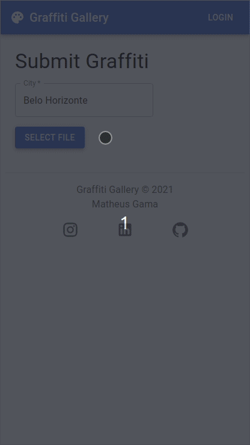

# 100 Days Of Code - Log

### Day 1: October 18, 2021

**Today's Progress**: Created a repo for a new project that will be a basic gallery of graffity photos taken around the world. Also created a basic design structure in plain html and css using bootstrap.

The goal was to set some basic design for the project so I don't have to think about it too much while getting into the React itself. There are some points that I'm still not happy with, like the login button and the submit button that should appear somewhere after the user is logged in. But I guess I should start this way and change those as new ideas come to mind. 

**Link to work:** 
- <https://github.com/mathgama/graffiti-gallery/commit/786bb9857ffa96962e98ac96b72ab5dbfd18d145>

### Day 2: October 19, 2021

**Today's Progress**: Created the NextJS app and started by cleaning up the initial files and adding needed packages like ESLint, Prettier and Bootstrap.

Found one unexpected error because the Bootstrap library doesn't work very well with the server-side rendering provided by NextJS. There is a workaround to solve this ([link](https://stackoverflow.com/questions/67845378/how-can-i-use-bootstrap-5-with-next-js)), but anyway I decided to then use Material-UI instead of Bootstrap, as Material-UI should work "out-of-the-box".

After this initial setup, I started creating the first component of the homepage in a second commit.

**Link to work:** 
- <https://github.com/mathgama/graffiti-gallery/commit/7210be12b6f5076c47083cc206638604d1f75e4b>
- <https://github.com/mathgama/graffiti-gallery/commit/a7f18f587f6d5ea0c7e547b6279dc4d80466ef24>

### Day 3: October 20, 2021

**Today's Progress**: Today I continued developing the UI components needed for the home page. I finished developing the image gallery and the pages now have a header (app bar) and a footer. I'm still using mock data to test the layout as the back-end will be developed in the future.

There are also some components left to do in the upcoming days that do not appear directly in the homepage, like the login page and the page to submit new images.

In the homepage I still need to decide what links I'll include in the navbar, so I left it with no links for now.

**Link to work:** 
- <https://github.com/mathgama/graffiti-gallery/commit/c89e7fcbb0688b83797649658fba792e61c90573>
- <https://github.com/mathgama/graffiti-gallery/commit/1f6e4b9abb05794de71b3ff54c96bd262242a3bd>
- <https://github.com/mathgama/graffiti-gallery/commit/ceff3b59b3aab69cea2687c6d311bf01f904bf27>
- <https://github.com/mathgama/graffiti-gallery/commit/43fd35541b67e92953fc939873388ce21463f653>

### Day 4: October 21, 2021

**Today's Progress**: Struggled a bit trying to find the best way to open the full image when the user clicks a card in the home page.

Need to make sure that the image scales to both "desktop" and "mobile" versions, and that in the mobile version the user will be able to zoom in to see more details. I did commit a first version, but I'm still not satisfied with the result, so I'll need to come back to it in the next days.

**Link to work:** 
- <https://github.com/mathgama/graffiti-gallery/commit/2854537ad9f0d7ec39402b270bb4bbee94891def>

### Day 5: October 22, 2021

**Today's Progress**: Started by removing some unnecessary files from the repo. 

Then created a "submit graffiti" page to enable new images upload. Graffiti data is still quite simple with only 4 fields, but I'll keep it that way until I start using a backend. Then I can enhance it later if needed.

Also made some adjustments to the "full image" view that I began yesterday. Now it is rendering way better than before on mobile devices.

**Link to work:** 
- <https://github.com/mathgama/graffiti-gallery/commit/f7b030c9cc755d5d696e58c979e1e9c5adb2bdb9>
- <https://github.com/mathgama/graffiti-gallery/commit/1cd00e6ddbc2e64a29b21a70784ab280b003a11f>
- <https://github.com/mathgama/graffiti-gallery/commit/0d66ab92c7bca3e91585f4a6c57acd2e406789e8>

### Day 6: October 23, 2021

**Today's Progress**: Decided to use Firebase Cloud Storage module to store the images uploaded by the users.

Had a rough time trying to make it work though. After a long time fiddling with the configuration, I discovered that the official portuguese documentation only have code snippets for the version 8 of the SDK, while I was using version 9. The problem is that the portuguese documentation doesn't even make it clear that there is a new version.

Portuguese docs:

English docs:

After switching to the english documentation I was finally able to get the upload to work!

**Link to work:** 
- <https://github.com/mathgama/graffiti-gallery/commit/19017977ca00bf17c5d4600babfb3597aed149e1>

### Day 7: October 24, 2021

**Today's Progress**: Enhanced the upload page by adding some feedback to the user that the image is being processed:

Then added some logic to generate an unique filename (using uuid) before sending the image to firebase. This will avoid name collision which can cause accidental overwriting in the storage. This same uuid should be used later on to create an entry in the database.

**Link to work:** 
- <https://github.com/mathgama/graffiti-gallery/commit/69554620949a15f8e5ea9ddde7cfc2ab2358ca31>
- <https://github.com/mathgama/graffiti-gallery/commit/ad6d08c15b247c0d39bb82d37133b55291e0b2d4>